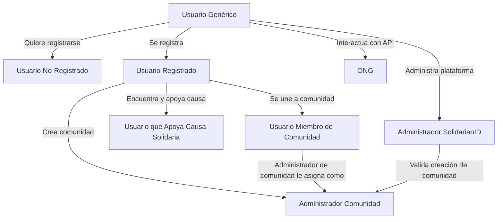

# SolidarianID

Una plataforma para conectar usuarios con comunidades solidarias y causas sociales, ofreciendo herramientas para registro, gestión y colaboración dentro de una red de solidaridad.

## Descripción

SolidarianID permite a los usuarios interactuar con comunidades solidarias, ya sea uniéndose, apoyando causas o creando nuevas comunidades. Además, proporciona roles específicos como administradores de comunidades o de la plataforma para mantener el sistema organizado y seguro

## Características

- Gestión de usuarios: Registro, roles y asignación de permisos.
- Interacción con comunidades: Únete, apoya causas o crea tu propia comunidad.
- Roles dinámicos: Usuario registrado, administrador de comunidad y administrador de plataforma.
- API de integración: Comunicación con ONG y otros servicios.
- Validación: Flujo de aprobación para la creación de nuevas comunidades.

## Tecnologías Utilizadas

- Lenguaje principal: TypeScript
- Front-end: React.js
- Back-end: Nest.js
- Base de Datos: MongoDB, PostgreSQL, Neo4J, Redis
- Diagramas: Mermaid.js (para visualización)

## Instalación y Ejecución

### Mediante `Docker Compose`:

```bash
cd ./cd-ci
docker compose up -d --build
```

### Mediante `npm`

```bash
npm install

// Por micro-servicio:
npm run start:dev // gateway (principal)
npm run start:communities
npm run start:users
npm run start:statistics
npm run start:front-end
```

> Para más opciones de ejecución mírese `package.json` > _"scripts"_.

### .net

- Acordarse de crear un fichero .dev en el root (/) del proyecto con las siguientes variables:

```env
# MongoDB Database:
MONGO_USERNAME=
MONGO_PASSWORD=
MONGO_DB=SolidarianID
MONGO_HOST=mongo
MONGO_PORT=27017

# PostgreSQL Database:
POSTGRES_USER=
POSTGRES_PASSWORD=
POSTGRES_DB=

# PGAdmin - PostgreSQL Web Interface:
PGADMIN_EMAIL=
PGADMIN_PASSWORD=
```

# Ramas:

- División por microservicios basada en [NestJS Monorepo](https://docs.nestjs.com/cli/monorepo):
  - Gateway (principal)
  - Comunidades
  - statistics (estadísticas)
  - Usuarios
  - Front-End (NestJS también)

```bash
.
├── docker-compose.yml                # Parent Docker Compose
└── apps
    ├── statistics                    # Platform administration microservice
        ├── src
        └── Dockerfile
    ├── communities                   # Main platform microservice
        ├── src
        └── Dockerfile
    ├── front-end                     # User Interface microservice
        ├── src
        └── Dockerfile
    ├── gateway                       # Main api-gateway and router
        ├── src
        └── Dockerfile
    └── users                         # User management microservice
        ├── src
        └── Dockerfile
```

# Autores

- [José Ramón Guillén López](https://github.com/JoseRa13)
- [Eneko Pizarro Liberal](https://github.com/itsNko)
- [Raúl Martínez García](https://github.com/raul080402)
- [Raúl Hernández Martínez](https://github.com/raul-umu)
- [Juan José López Olmos](https://github.com/juanj0070)

# Jerarquía de Usuarios:


