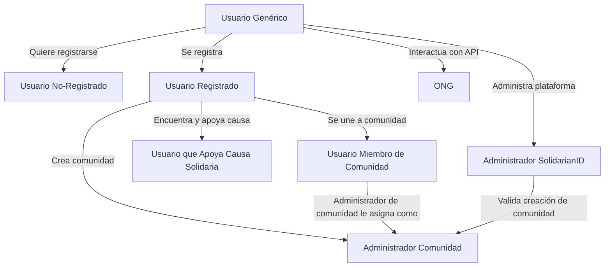

# SolidarianID 

Una plataforma para conectar usuarios con comunidades solidarias y causas sociales, ofreciendo herramientas para registro, gestión y colaboración dentro de una red de solidaridad.

##  Descripción 

SolidarianID permite a los usuarios interactuar con comunidades solidarias, ya sea uniéndose, apoyando causas o creando nuevas comunidades. Además, proporciona roles específicos como administradores de comunidades o de la plataforma para mantener el sistema organizado y seguro

##  Características

* Gestión de usuarios: Registro, roles y asignación de permisos.
* Interacción con comunidades: Únete, apoya causas o crea tu propia comunidad.
* Roles dinámicos: Usuario registrado, administrador de comunidad y administrador de plataforma.
* API de integración: Comunicación con ONG y otros servicios.
* Validación: Flujo de aprobación para la creación de nuevas comunidades.

## Tecnologías Utilizadas

* Lenguaje: TypeScript
* Frontend: React.js
* Backend: Node.js con Express.js
* Base de Datos: MongoDB, PostgreSQL, Neo4J, Redis
* Diagramas: Mermaid.js para visualización

## Instalación 

`$ npm install ...`

Pendiente de rellenar.

## Autores

* [José Ramón Guillén López](https://github.com/JoseRa13)
* [Eneko Pizarro Liberal](https://github.com/itsNko)
* [Raúl Martínez García](https://github.com/raul080402)
* [Raúl Hernández Martínez](https://github.com/raul-umu)
* [Juan José López Olmos](https://github.com/juanj0070)

# Jerarquía de Usuarios:

