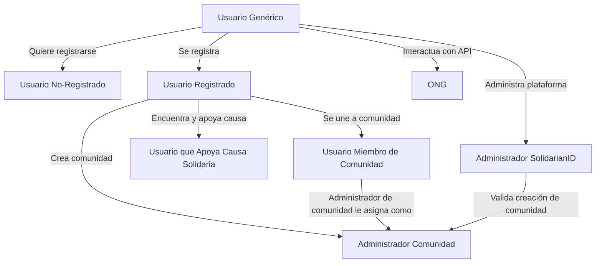

# Gerarquía de Usuarios:

```mermaid
flowchart TD
    A[Usuario Genérico] -->| Quiere registrarse | B[Usuario No-Registrado]
    A -->|Se registra| C[Usuario Registrado]
    C -->| Se une a comunidad | D[Usuario Miembro de Comunidad]
    C -->|Encuentra y apoya causa| E[Usuario que Apoya Causa Solidaria]
    C -->|Crea comunidad| F
    D -->|Administrador de comunidad le asigna como| F[Administrador Comunidad]
    A -->|Interactua con API| G[ONG]
    A -->|Administra plataforma| H[Administrador SolidarianID]
    H -->|Valida creación de comunidad| F
```
