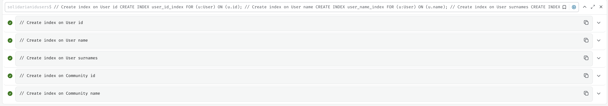

To make the find function query faster, you can create indexes on the properties that are frequently queried. In this case, you should create indexes on the id, name, and surnames properties of the User nodes, and the id and name properties of the Community nodes.

Here are the Cypher statements to create these indexes:

```SQL
// Create index on User id
CREATE INDEX user_id_index FOR (u:User) ON (u.id);

// Create index on User name
CREATE INDEX user_name_index FOR (u:User) ON (u.name);

// Create index on User surnames
CREATE INDEX user_surnames_index FOR (u:User) ON (u.surnames);

// Create index on Community id
CREATE INDEX community_id_index FOR (c:Community) ON (c.id);

// Create index on Community name
CREATE INDEX community_name_index FOR (c:Community) ON (c.name);
```

You can run these statements in the Neo4j Browser or using the Neo4j command-line tool to create the indexes.

Using Neo4j Browser:

- Open the Neo4j Browser at http://localhost:7474.
- Connect to your Neo4j database.
- Copy and paste the above Cypher statements into the query editor.
- Run the queries by clicking the "Run" button or pressing Ctrl+Enter.
  Using Neo4j command-line tool:

- Ensure your Neo4j server is running.
- Open a terminal and run the following commands:

```bash
cypher-shell -u <username> -p <password> "CREATE INDEX user_id_index FOR (u:User) ON (u.id);"
cypher-shell -u <username> -p <password> "CREATE INDEX user_name_index FOR (u:User) ON (u.name);"
cypher-shell -u <username> -p <password> "CREATE INDEX user_surnames_index FOR (u:User) ON (u.surnames);"
cypher-shell -u <username> -p <password> "CREATE INDEX community_id_index FOR (c:Community) ON (c.id);"
cypher-shell -u <username> -p <password> "CREATE INDEX community_name_index FOR (c:Community) ON (c.name);"
```

Replace <username> and <password> with your Neo4j credentials.

These indexes will help speed up the queries in the find function by allowing Neo4j to quickly locate nodes based on the indexed properties.


